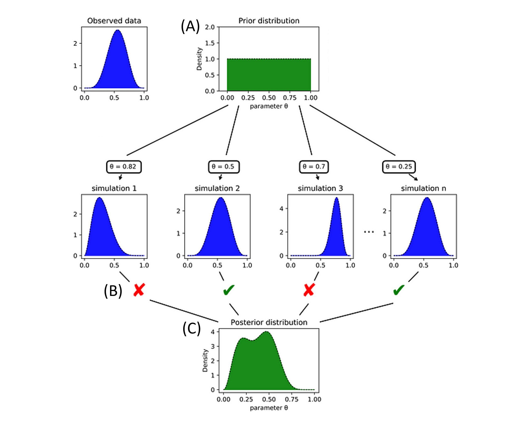
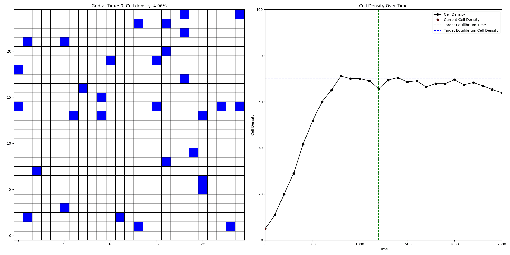
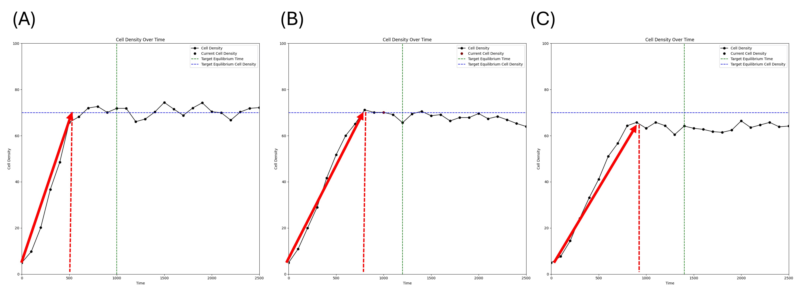
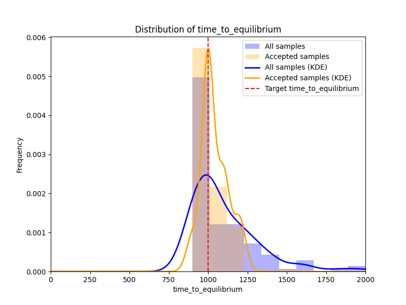
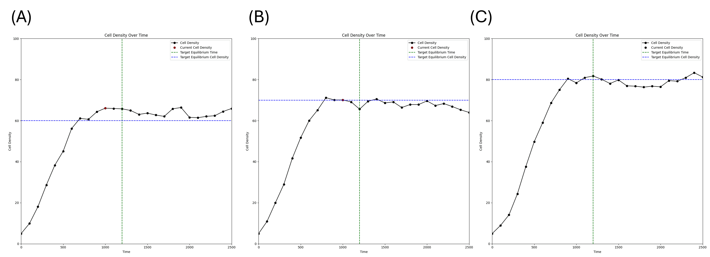

# Parameter estimation for ABMs to drive desired model behavior using Approximate Bayesian Computation (ABC)

## Table of contents

- [Introduction](#introduction)
- [Methods](#methods)
    - [Rejection approximate Bayesian computation (ABC)](#rejection-approximate-bayesian-computation-abc)
    - [Birth-migration-death model](#birth-migration-death-model)
    - [Agent-based Representation of Cells And Dynamic Environments (ARCADE)](#agent-based-representation-of-cells-and-dynamic-environments-arcade)
- [Results](#results)
    - [ABC accurately predicts model parameters driving the desired $t_{eq}$ and $\rho$](#abc-accurately-predicts-model-parameters-driving-the-desired-teq-and-rho)
    - [Graphical user interface (GUI) for ARCADE accelerates the development of ABMs](#graphical-user-interface-gui-for-arcade-accelerates-the-development-of-abms)
- [References](#references)

## Installation
Package and dependency management for this project is done with Poetry. To install dependencies, navigate to the project folder in the command line and run:
```bash
poetry install
poetry shell
```
To run the parameter estimation with the GUI, run the following command:
```bash
python -m inverse_design.gui.run_gui
```
To run the BDM demo, please refer to the [BDM repository](https://github.com/pohaoc2/birth-migration-death).

## Introduction

Parameter estimation is crucial for computational researchers to identify model parameters to match experimental data and predict emergent behaviors. 
Traditional parameter estimation methods, including likelihood-based approaches and least-squares methods, have been used to find parameters for chemical kinetics models [^1][^2] and infer protein force-fields [^3] in ordinary and partial differential equation models. 
In addition to these models, agent-based models (ABMs) have been widely used to interrogate underlying interactions between cells and their microenvironment, capturing spatial heterogeneity and stochastic behaviors. 
However, the stochastic nature of ABMs prevents us from summarizing complex model behaviors with explicit functions. 
Furthermore, as the model complexity increases—due to a larger number of agents, probabilistic rules, and environmental interactions—parameter estimation becomes more difficult.
Therefore, a generalizable framework to identify parameters driving desired emergent behaviors is essential for accelerating the development of ABMs in biological domains.

## Methods
### Rejection approximate Bayesian computation (ABC)
ABC is a Bayesian inference technique used to estimate the posterior distributions of model parameters based on a given set of observations, particularly when the system's likelihood function is intractable and observations are available [^4]. To improve the transparency of interpreting model parameter distributions and relate them with known tumor types, I will integrate the simplest approach among these algorithms—rejection ABC—with ARCADE. 

To derive the posterior distributions from observations, rejection ABC begins by randomly sampling from the prior distributions of the model parameters (Figure 1A). Subsequently, the algorithm compares the model output ($y_{sim}$) generated from these samples to desired metrics (Figure 1B, Observed Data). The algorithm retains samples where the distance (d) between the model output and the desired metrics ($y_{desired}$) falls within a predefined distance threshold ($\delta$). The distribution of these accepted samples serves as an approximation of the posterior (Figure 1C).

### Birth-migration-death model
To demonstrate the expected outcomes—the posterior parameter distribution driving desire outcomes—I prepare a "minimum viable product" (MVP). 
The MVP uses the birth-migration-death agent-based model, where cell agents can proliferate, migrate, and die in a 2-dimensional grid, with these actions governed by kinetic reactions [^5]. 
The emergent metrics of the MVP are (i) equilibrium cell density ($\rho$) and (ii) time to reach steady-state ($t_{eq}$).


### Agent-based Representation of Cells And Dynamic Environments (ARCADE)
Details of the ARCADE framework are available in the [ARCADE repository](https://github.com/bagherilab/ARCADE).

## Results
### ABC accurately predicts model parameters driving the desired $t_{eq}$ and $\rho$.
To test if the MVP can provide parameters that generate desired $t_{eq}$, I fix $\rho=70\%$ and adjust desired $t_{eq}=1000, 1200, 1400$. 
The expected outcome is that: cell agents take longer time to reach steady-state when setting the desired $t_{eq}$ to greater values. 
The decreasing slopes of the red arrows illustrates longer $t_{eq}$.
 
Moreover, to test if the MVP drives the desired $t_{eq}$ distribution, I demonstrate the kernel density function of $t_{eq}$ obtained from parameters sampled from prior and posterior.

The narrower distribution confirms that ABC successfully identifies parameters generating desired $t_{eq}$.

Additionally, similar to the previous section, I fix $t_{eq}=1200$ and adjust the desired $\rho=60, 70, 80$. 
As expected, the equilibrium cell densities increase as the desired cell density is set to a higher value.



### Graphical user interface (GUI) for ARCADE accelerates the development of ABMs
The GUI-enabled ABC framework allows users to upload files for model parameters, metrics, and configuration settings. Users only need to provide the model parameter files and corresponding simulation metrics results. Then, users can specify target metrics and assign weights to guide parameter estimation. The interface visualizes both prior and posterior distributions obtained through ABC, providing an intuitive way to explore how parameter adjustments influence model outcomes. Demo can be found below:


## References
[^1]: Puxty, G., Maeder, M., & Hungerbühler, K. (2006). Tutorial on the fitting of kinetics models to multivariate spectroscopic measurements with non-linear least-squares regression. Chemometrics and Intelligent Laboratory Systems, 81(2), 149-164.
[^2]: Kraeutler, M. J., Soltis, A. R., & Saucerman, J. J. (2010). Modeling cardiac β-adrenergic signaling with normalized-Hill differential equations: comparison with a biochemical model. BMC systems biology, 4, 1-12.
[^3]: Varnai, C., Burkoff, N. S., & Wild, D. L. (2013). Efficient parameter estimation of generalizable coarse-grained protein force fields using contrastive divergence: a maximum likelihood approach. Journal of chemical theory and computation, 9(12), 5718-5733.
[^4]: Beaumont, M. A., Zhang, W., Balding, D. J., & Rannala, B. (2009). Approximate Bayesian computation in population genetics. Genetics, 182(2), 257-270.
[^5]: Nardini, M., & Nardini, A. (2021). Learning the rules of cell migration. Nature, 596(7871), 241-246.